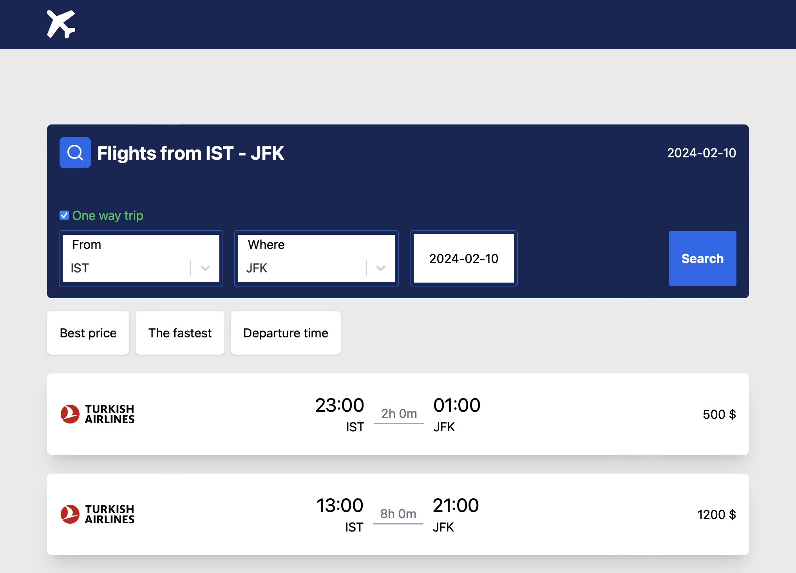

# Amadeus Flight Search Application

Bu proje, kullanıcıların uçuş aramalarını yapmalarını ve sonuçları görüntülemelerini sağlayan bir frontend uygulamasıdır.

## Kurulum

1. Proje dosyalarını klonlayın.
2. `npm install` komutunu çalıştırın.
3. `npx json-server --watch db.json  --port 3000` komutu ile mock apiyi çalıştırın.
4. `npm run dev` komutu ile projeyi başlatın.

##Kullanım
db.json içinde tüm günler için uçuş olmadığından test için kullanabilecek güzergah ve tarihler:

1. IST-JFK Gidiş: 2024-02-10 - Dönüş: 2024-02-15
2. SFO-IST Gidiş: 2024-02-25 - Dönüş: 2024-02-28

