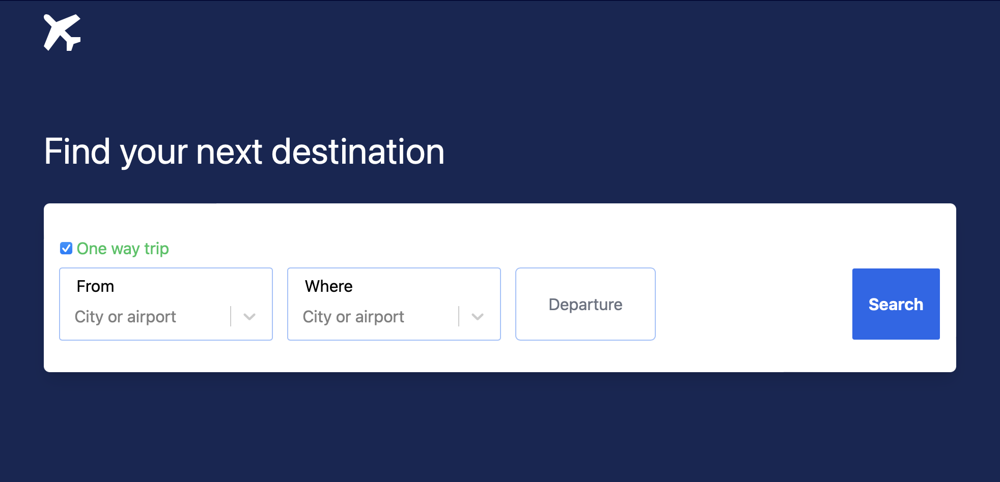

# Amadeus Flight Search Application

Bu proje, kullanıcıların uçuş aramalarını yapmalarını ve sonuçları görüntülemelerini sağlayan bir frontend uygulamasıdır.

## Kurulum

1. Proje dosyalarını klonlayın.
2. `npm install` komutunu çalıştırın.
3. `npm run dev` komutu ile projeyi başlatın.

### mock api node.js kullanılarak vercel üzerinde depolay edildi

https://flight-api-kappa.vercel.app/flights

## Kullanım

db.json içinde tüm günler için uçuş olmadığından test için kullanabilecek güzergah ve tarihler:

1. IST-JFK Gidiş: 2024-02-10 - Dönüş: 2024-02-15
2. SFO-IST Gidiş: 2024-02-25 - Dönüş: 2024-02-28

## Case Açıklamaları

Case Study: Flight Search Application (UI Developer)
Açıklama
Bir uçuş arama uygulaması için frontend application geliştirilecek.
Beklentiler:

Arama Özelliği:
Kalkış havaalanı, varış havaalanı, kalkış tarihi, dönüş tarihi seçilebilen bir arama kutusu yapılmalı
“Tek yönlü uçuş” olduğunu belirten bir seçenek olmalı. Bu seçildiyse dönüş tarihi girilmemeli.
Dönen sonuçlar listelenmeli.
Kalkış ve varış havaalanı input kutularında yazıldığı anda havaalanları koda ve şehre göre search edilmeli ve uygun olanlar listelenmeli.
Kalkış ve dönüş tarihi input kutularında datepicker kullanılmalı.
Tüm alanların validasyonu yapılmalı

Listeleme Özelliği:
Listelenen uçuşlar kalkış saati, dönüş saati, uçuş uzunluğu, ya da fiyata göre sıralanabilmeli
Sunucudan cevap gelene kadar kullanıcıya “yükleniyor” animasyonu gösterilmeli
Listelenen uçuşların detay bilgileri gösterilmeli (havayolu, şehir, vs.)

Hata kontrolü: Sunucudan gelen tüm hata durumları handle edilmeli
Mock Data: Tüm API istekleri için bir mock API ve mock data oluşturulmalı. Frontend buna yapılan istekler üzerinden çalışmalı.
Boş data kontrolü: Sunucudan boş data gelmesi durumu handle edilmeli
Framework: İstenilen Javascript framework kullanılabilir
Git versiyon sistemi kullanılmalı. Proje GitHub’a yüklenilecek.
